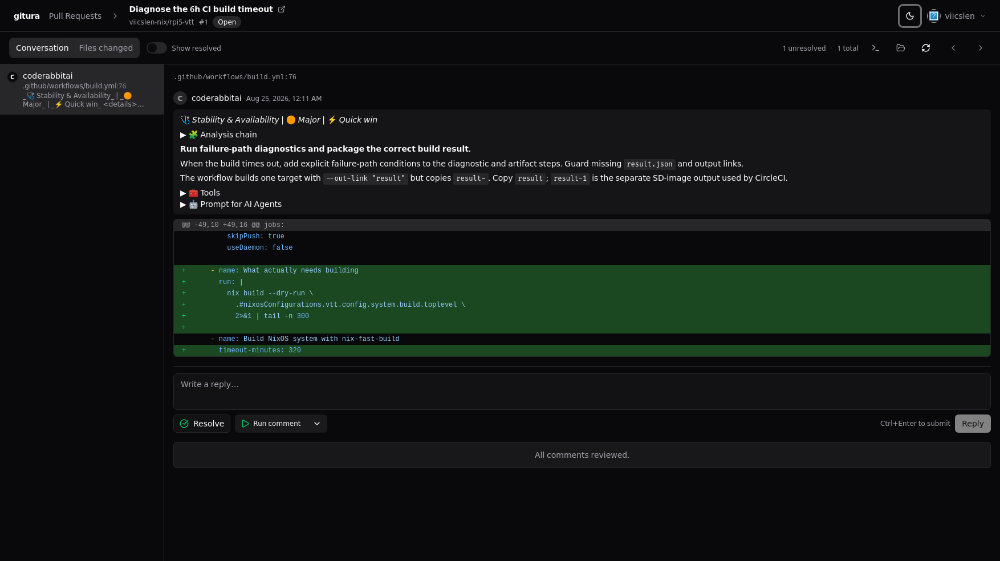
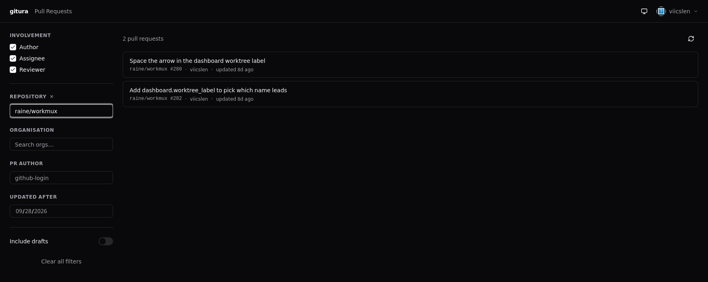
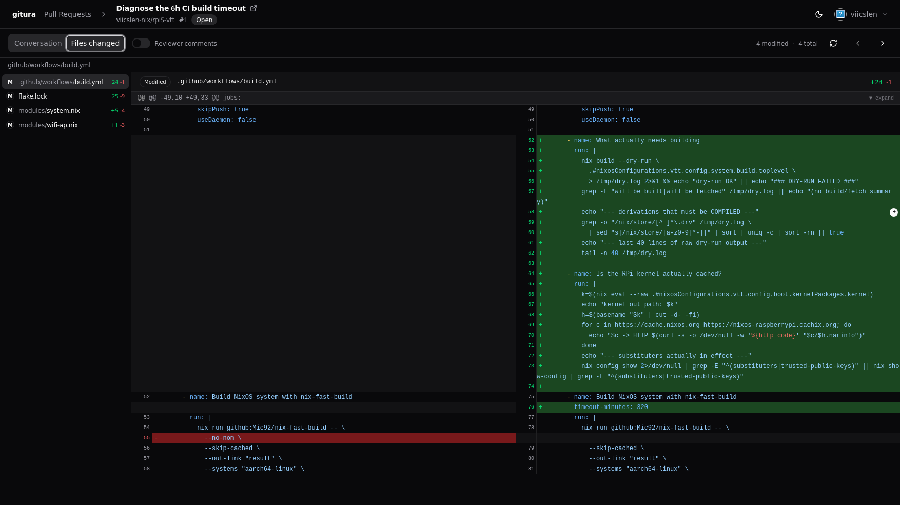
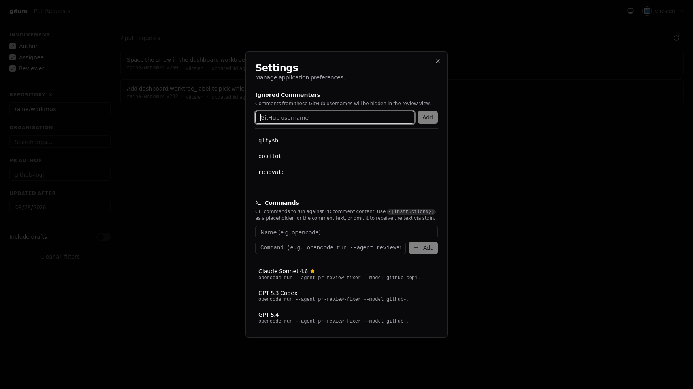
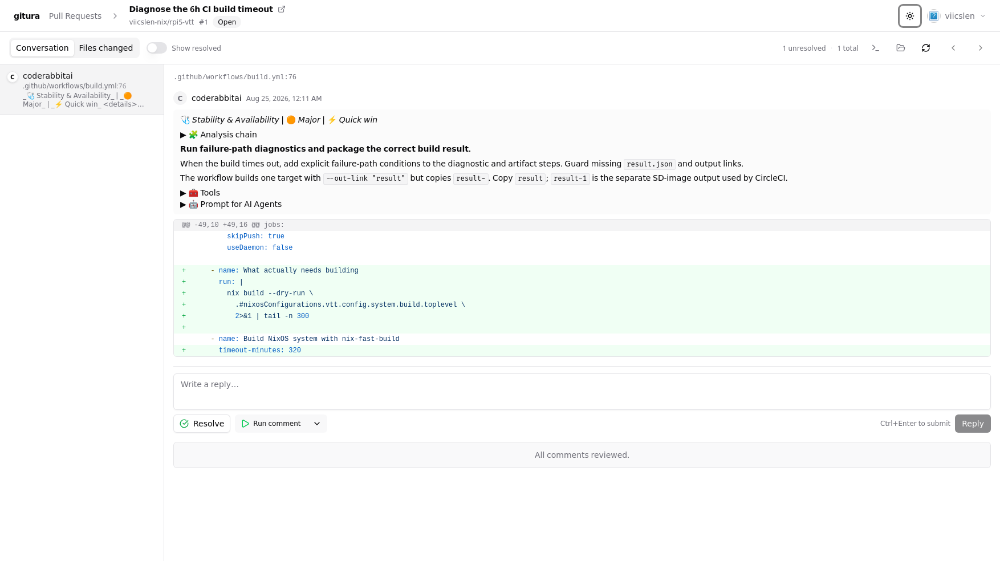

<div align="center">

# gitura

**Review GitHub pull requests from a native desktop app.**

Load a PR, walk its review comments one by one, reply, resolve, commit suggestions,
and hand a comment straight to your coding agent — without a browser tab in sight.

[](https://github.com/viicslen/gitura/actions/workflows/ci.yml)
[](https://github.com/viicslen/gitura/releases/latest)
[](#license)
[](https://go.dev)
[](https://wails.io)



</div>

## Screenshots

| Pull requests | Files changed |
| ------------- | ------------- |
|  |  |
| Filter by involvement, repository, organisation, author, or date | Split diff with syntax highlighting and inline comments |

| Settings | Light theme |
| -------- | ----------- |
|  |  |
| Ignored commenters and the CLI commands you can run on a comment | Dark, light, and system themes |

## Features

- **Pull request list** — everything you author, are assigned, or are asked to review, filtered by repository, organisation, author, or last-updated date
- **Conversation view** — step through review comments one at a time with diff hunk context and thread replies
- **Files changed view** — split diff with syntax highlighting, per-file sidebar, and inline comments on any line
- **Batch reviews** — draft comments, then submit them together as comment, approval, or changes requested
- **Reply, resolve, unresolve** — posted straight to GitHub with optimistic UI updates
- **Commit suggestions** — accept a GitHub suggestion block and commit it to the PR branch
- **Run commands** — pipe a comment into any CLI (e.g. an `opencode` agent) from the comment itself and watch the output in the run panel
- **Ignored commenters** — filter out CI bot noise by username
- **Dark, light, and system themes**

## Install

### Download a release

Prebuilt binaries for Linux, macOS, and Windows are attached to every
[release](https://github.com/viicslen/gitura/releases/latest), with SHA-256 checksums.

### Nix

```sh
nix run github:viicslen/gitura
```

### Build from source

See [Development](#development).

## Requirements

### Runtime

| Platform | Dependencies                        |
| -------- | ----------------------------------- |
| macOS    | None beyond the app bundle          |
| Linux    | `libwebkit2gtk-4.1`, `libsecret-1`  |
| Windows  | None beyond the app bundle          |

### Environment

```sh
GITURA_GITHUB_CLIENT_ID=<your GitHub OAuth App client ID>
```

This variable is read at **build/dev time** and injected into the binary via `-ldflags`.
Copy `.env.example` to `.env`, fill in the value, and use the `just dev` / `just build`
recipes below.

### GitHub OAuth App

Create an OAuth App at **GitHub → Settings → Developer settings → OAuth Apps** with:

- **Authorization callback URL**: `http://localhost` (Device Flow does not use a callback, but GitHub requires a value)
- Copy the **Client ID** into `GITURA_GITHUB_CLIENT_ID`

No client secret is needed — the app uses the
[Device Authorization Grant](https://docs.github.com/en/apps/oauth-apps/building-oauth-apps/authorizing-oauth-apps#device-flow).

The requested scope is **`repo`**, required for the GraphQL mutations that resolve and
unresolve review threads on private repositories.

## Authentication

Sign-in uses GitHub Device Flow:

1. Click **Sign in with GitHub** — a user code is displayed in the app
2. Visit the verification URL (opened automatically in your browser)
3. Enter the code and authorize the app
4. The app polls GitHub and stores the token in your OS keychain on success

The token lives in the OS native keychain — never on disk, never in logs.

## Development

### Prerequisites

- Go 1.25+
- [Bun](https://bun.sh) (the frontend workspace is Bun-managed)
- [Wails v2 CLI](https://wails.io/docs/gettingstarted/installation): `go install github.com/wailsapp/wails/v2/cmd/wails@latest`
- On Linux: `libwebkit2gtk-4.1-dev`, `libsecret-1-dev`, `libgtk-3-dev`

A Nix flake is provided — `nix develop` (or `direnv allow`) gives you all of the above.

### Common tasks

```sh
just dev      # hot-reload dev server (injects GITHUB_CLIENT_ID from .env)
just build    # build for the current platform → build/bin/
```

```sh
# CI-equivalent checks
CGO_ENABLED=1 GOFLAGS='-tags=webkit2_41' go test -race -count=1 ./internal/...
CGO_ENABLED=1 GOFLAGS='-tags=dev,webkit2_41' golangci-lint run
cd frontend && bun run build
```

`just dev` also serves the UI at `http://localhost:34115` for browser devtools.

> **Note**: Wails v2 does not support cross-compilation. Build each platform natively.

## Project structure

```text
.
├── app.go                  # Wails-bound App methods (auth, PRs, comments, runs, settings)
├── main.go                 # wails.Run() entry point
├── internal/
│   ├── auth/               # GitHub OAuth 2.0 Device Flow
│   ├── db/                 # SQLite app state (sqlc-generated queries)
│   ├── github/             # GitHub REST + GraphQL API client
│   ├── keyring/            # OS keychain token storage (go-keyring)
│   ├── logger/             # Structured slog logger (GITURA_LOG_LEVEL)
│   ├── model/              # Shared DTO types (Go ↔ Vue boundary)
│   ├── runner/             # CLI command execution for review comments
│   └── settings/           # User preferences (settings.toml)
├── frontend/
│   └── src/
│       ├── components/     # App-specific Vue components
│       ├── components/ui/  # shadcn-vue primitives
│       ├── composables/    # useAuth, usePRFilters, useReview, useRuns, useTheme
│       └── pages/          # AuthPage, PRPage, ReviewPage, SettingsPage
├── specs/                  # Feature specifications and contracts
└── tests/fixtures/         # Recorded GitHub API responses for offline tests
```

## License

MIT
